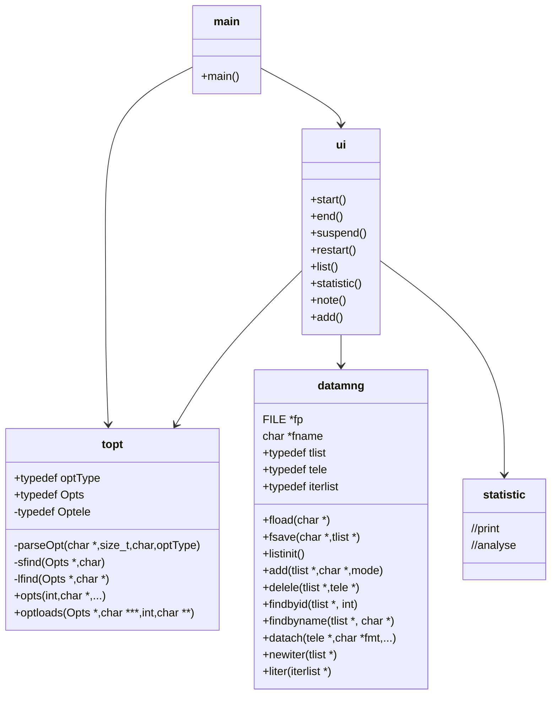

# 项目结构

项目将分为一个主文件和相关库组成. 软件几乎所有功能要在库中实现. 这样可以达到复用的目的. 同时在功能增加时可以更加容易.

```mermaid
classDiagram
class main{
+main()
}

class topt{
+typedef optType
+typedef Opts
-typedef Optele


-parseOpt(char *,size_t,char,optType)
-sfind(Opts *,char)
-lfind(Opts *,char *)

+opts(int,char *,...)
+optloads(Opts *,char ***,int,char **)
}

class datamng{
FILE *fp
char *fname
+typedef tlist
+typedef tele
+typedef iterlist

+fload(char *)
+fsave(char *,tlist *)

+listinit()
+add(tlist *,char *,mode)
+delele(tlist *,tele *)
+findbyid(tlist *, int)
+findbyname(tlist *, char *)
+datach(tele *,char *fmt,...)
+newiter(tlist *)
+liter(iterlist *)
}

class statistic{
//print

//analyse
}

class ui{
+start()
+end()
+suspend()
+restart()
+list()
+statistic()
+note()
+add()
}

main-->ui
main-->topt
ui-->topt
ui-->datamng
ui-->statistic
```

